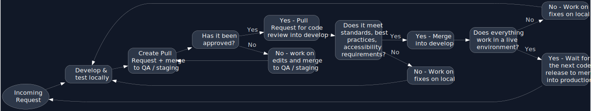

# WordPress Development Workflow

Our websites code on the VIP Platform can only be modified using a version-controlled GitHub development workflow. **There is no SFTP access to an application’s code or other related assets.**

## Dev Enviroments

In addition to `production`, we have two development environments: `develop` and `staging`

Each environment is its own standalone site, with its own codebase and its own database.

- Each environment has it's own branch in our repo
  - Technically two branches: `develop` & `develop-built`
  - This is because of our build process
  - `staging`, `develop` and `production` are what we create pull requests towards
  - `staging-built`, `develop-built`, and `production-built` are what are actually get deployed and shown to the final user

## WordPress Workflow for Development

1. Create new git branch based off `develop` branch [naming convention below](local-development/wordpress-dev-workflow?id=branch-naming-convention).
2. Develop & test locally. Commit early, commit often **(do not push up to remote)**.
3. Once it's good locally: create a pull request from your branch into `staging` branch.
   - Pull request should include a description of what the merge will affect (use PR templates).
   - Assign the project lead as a reviewer.
   - Code review to ensure "best practice" standards, and no clashes with other code. Await reviewers' approval for merge.
   - Add labels if applicable (at least a priority label).
     - **Priority 1** - High priority - Should be released ASAP (e.g. bug fixes).
     - **Priority 2** - Mid-level priority - Should be released at earlies convenience.
     - **Priority 3** - Low priority - Does not need to be released at the moment.
4. After mergin your branch into `staging` and once build process has run, check preprod site for testing/QA
    - Make any database (wp-admin) changes to `staging` site.
    - If external review/approval is needed from other teams and/or the client, send them the `staging` link so they can test/review.
5. Apply any necessary changes/revisions, and re-push to `staging` branch, re-review as necessary
6. Once the `staging` version is approved, go back to your feature branch and create a new pull request to merge into `develop`
   - Commits may need to be squashed
7. Once branch is merged into `develop`, do one final round of QA/testing on develop site.
   - Make any database (wp-admin) changes to develop site
8. During the next scheduled code release, the `develop` branch (which at this point likely includes multiple new 'feature' branches that have gone through the above workflow) will be merged into the `production` branch.
9. Perform one final test on the live site to ensure everything is good.
   - Make any database (wp-admin) changes to live site

!> Never do Pull Requests/merges to the `production` branch from a feature branch (only reverting code or emergency fixes).

!> Do not commit the files in the `dist` folder. These will be built on merge for each environment branch.

## Branch Naming Convention

When you are working on a bug, feature, or improvement, you will need to create a branch.

Branch naming convention includes folders to keep our branches as organized as possible:

- `plugins/{plugin-name-slug-folder}/{feature-or-fix-name}` for plugin development
- `plugins/{plugin-name-slug-folder}` for 3rd party plugin updates
- `themes/{specific-theme-slug}/{feature-name}` for developing a feature which will specifically apply to one theme
- `themes/{feature-name-for-all-themes}` for developing a fix/feature that will apply to all the sites' themes

## Coding Flowchart

## Committing

We encourage developers to write [meaningful commit messages](https://www.freecodecamp.org/news/how-to-write-better-git-commit-messages/).

### Contribution guidelines

#### Code quality

Follow the instructions from the [WPVIP documentation](https://docs.wpvip.com/how-tos/php_codesniffer/) about installing and using PHP CodeSniffer. This will get the correct standards installed.

VIP recommends integrating PHPCS inside code editors or IDEs to receive PHPCS feedback in real-time during development. For VS Code, [multiple](https://marketplace.visualstudio.com/search?term=phpcs&target=VSCode&category=All%20categories&sortBy=Relevance) plugins are available.

#### Style guide

[Stylelint](https://stylelint.io/), ESLint and prettier are used. ESLint's recommended rules are used for code-quality. Formatting is handled by prettier. If you have ESLint installed with your text editor of choice, you should be up and running.

#### Consider accessibility in UI changes

If the change you're proposing touches a user interface, include accessibility in your approach. This includes things like color contrast, keyboard accessibility, screen reader labels, and other common requirements. For more information, check out the Forem Accessibility docs page.

## Pull Request

Follow [these steps](local-development/preparing-pr.md) when preparing a pull request

### Pull request reviews

All pull requests should be are reviewed by the project lead or the person assign to this particular task.

- All required CI checks are expected to pass on each PR.
- In the case of flaky or unrelated test failures, a core team member will restart CI.
- Requested Changes must be resolved (with code or discussion) before merging.
- If you make changes to a PR, be sure to re-request a review.
- Style discussions are generally discouraged in PR reviews; make a PR to the linter configurations instead.
- Your code will be deployed shortly after it is merged.

## Final conclusion

We are a group of individuals working together to build outstanding websites for our clients and learn from each other. It's important to treat each other with kindness and acknowledge that compromises may need to be made.

----------------------------------------------------------------------

> Last Modified: {docsify-updated}
